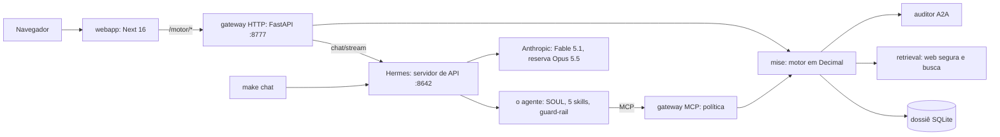

# Sabor da Maria

**Um agente de IA que leva a Dona Maria da despensa ao cardápio de lançamento.**

O agente é o [Hermes Agent](https://github.com/NousResearch/hermes-agent), da
Nous Research, instalado do repositório oficial num commit fixo e customizado
num perfil próprio, o `sabor-da-maria`. A Dona Maria está abrindo o primeiro
delivery, já pôs R$ 663,39 em 37 ingredientes e tem mais R$ 80,00 para
complementar. O agente pesquisa na web receitas reais que aproveitam a despensa,
pergunta se ela gosta de fazer cada uma e se vê algum impedimento, confere se a
cozinha e a rotina dão conta do prato antes de qualquer compra, compara a
receita com o que ela tem e com o que falta dentro do orçamento, e só então
calcula o custo por porção e três caminhos de preço, já com os 10% da
plataforma. Quem decide é ela. O modelo conversa, e todo número sai de um motor
determinístico, com a conta à mostra.

A Dona Maria só responde o que é dela, o gosto, os equipamentos, as técnicas e
os limites da rotina. Peso, medida, quantidade, rendimento e preço chegam
prontos, com a fonte, ditos como estimativa e corrigíveis quando ela quiser. O
preço do que falta comprar é a média de supermercados de São Paulo.

O mesmo agente atende em duas portas. No terminal, `make chat` abre o Hermes no
perfil do projeto. Na web, `make demo` sobe o site em http://localhost:3000, com
a conversa ao lado de toda tela. As telas (Despensa, Cozinha, Receitas, Pôr
preço, Cardápio) mostram a memória do agente e deixam que ela a corrija. O que
ela muda numa tela o agente lê no turno seguinte, e o que ele grava na conversa
aparece na tela na hora.

**Vídeo da demonstração:** [youtu.be/zHXVD6i2ptU](https://youtu.be/zHXVD6i2ptU).
Para rodar, é um comando, `ANTHROPIC_API_KEY=sua-chave make comecar` (veja
[Como rodar do zero](#como-rodar-do-zero)).

O enunciado está em [`docs/DESAFIO.md`](docs/DESAFIO.md), e a planilha dela em
[`dados/despensa_dona_maria.xlsx`](dados/despensa_dona_maria.xlsx).

## O Hermes Agent neste projeto

**Instalação.** `make instalar-hermes` roda o instalador oficial da Nous
Research preso ao commit
[`ee8a919f`](https://github.com/NousResearch/hermes-agent/commit/ee8a919fd2769166d45ebf67f45ff5b1acec69fe),
a versão 0.21.4, em que o projeto foi medido
([`scripts/instalar_hermes.sh`](scripts/instalar_hermes.sh)). O Hermes roda como
veio, sem fork, e o servidor de API dele atende também o chat da web
([ADR 0001](docs/adr/0001-hermes-e-o-servidor-de-api-como-runtime.md)).

**Perfil dedicado.** `make bootstrap` cria o perfil `sabor-da-maria`, em
`~/.hermes/profiles/sabor-da-maria`, como cópia do perfil padrão, e instala nele
a persona, as cinco skills, o plugin de guard-rail, o servidor MCP do motor e o
overlay de configuração, fundido chave por chave no `config.yaml` sem tocar nas
credenciais
([`hermes/bootstrap.sh`](hermes/bootstrap.sh),
[`hermes/configurar_perfil.py`](hermes/configurar_perfil.py)). Rodar de novo dá
o mesmo resultado. Cada decisão da customização vem abaixo, com o motivo.

**Modelo e esforço.** `claude-fable-5-1` com esforço `medium`, e
`claude-opus-5-5` como reserva quando o provedor falha, com o mesmo SOUL, as
mesmas skills e o mesmo esforço
([`hermes/config.overlay.yaml`](hermes/config.overlay.yaml)). No Fable 5.1 o
esforço médio fica perto do alto dos modelos anteriores, com menos espera e
menos custo. Não há `temperature` nem `top_p`, porque esses modelos recusam
parâmetro de amostragem com HTTP 400, e um teste reprova o overlay que os traga
([ADR 0009](docs/adr/0009-modelo-esforco-e-sem-amostragem.md)).

**Arquivos de contexto.** O [`hermes/SOUL.md`](hermes/SOUL.md) diz quem é o
agente, o que se pergunta a ela e o que não se negocia, número só de
ferramenta, cozinha só pelo perfil e receita só do catálogo. No chat da web, o
gateway acrescenta em todo turno a mesma instrução de sistema, `INSTRUCAO_DA_WEB`
em [`gateway/src/gateway/conversa.py`](gateway/src/gateway/conversa.py), que
avisa que a tela desenha um cartão por ferramenta e pede para não repetir o que
o cartão mostra; ela nunca muda, para o começo do prompt continuar no cache. A
mensagem dela chega com uma linha de contexto da tela, "[a senhora está vendo
...]", sem valor em reais, para "isso" e "esse" terem referente, e os botões dos
cartões mandam "[a senhora já respondeu pela tela: ...]", para o agente não
gravar a mesma resposta de novo.

**Ferramentas e MCP.** O motor entra como o servidor MCP `mise`, que o Hermes
sobe com o `python -m gateway.principal` do ambiente do projeto, e oferece 27
ferramentas, 20 de leitura e 7 de escrita
([`mise/src/mise/mcp_server.py`](mise/src/mise/mcp_server.py)). Entre os dois
fica uma política em código, com o escopo de cada ferramenta, cobrado quando o
ambiente define os tokens, limite de taxa, cota, disjuntor e trilha de auditoria
([`gateway/src/gateway/politica.py`](gateway/src/gateway/politica.py)). O
`tool_search` do Hermes fica desligado, para os esquemas irem inteiros desde a
primeira chamada, porque no modo automático o modelo gastava uma ida e volta
de 1,7 a 3,5 s só para ler o esquema. Arquivo, terminal, execução de código,
navegador e controle do computador ficam desligados, depois que o agente usou
`search_files` e `read_file` na pasta pessoal para procurar a planilha.

**Guard-rail.** O plugin
[`guardrail-numerico`](hermes/plugins/guardrail-numerico/__init__.py) usa cinco
hooks do Hermes. O `transform_llm_output` confere cada valor em reais da
resposta contra o que o motor devolveu na conversa inteira e o que ela disse, e
troca o valor sem origem por "[valor retirado]"; o `post_tool_call` junta essas
saídas por sessão, e o `on_session_start` começa cada sessão do zero. O
`transform_tool_result` embrulha a saída das ferramentas de web como dado não
confiável, e o `pre_tool_call` barra o `skill_manage`
([ADR 0004](docs/adr/0004-guard-rail-numerico.md)).

**Memória.** Cada fato mora num lugar só. A sessão do Hermes guarda o fio da
conversa, o `conversas.db` guarda as conversas da web, e o dossiê em SQLite
guarda a despensa, a cozinha, as receitas, os gostos e as decisões, com o
histórico de cada mudança e o desfazer. O `MEMORY.md` do Hermes fica desligado,
porque seria uma segunda cópia resumida desses fatos envelhecendo sem ninguém
ver, e o `USER.md` guarda só preferência de conversa, como o jeito que ela gosta
de ser chamada ([ADR 0008](docs/adr/0008-memoria-em-camadas.md)).

**Skills.** Cinco skills seguem o caminho do enunciado,
`diagnostico-despensa`, `pesquisa-receitas`, `elicitacao-restricoes`,
`precificacao-delivery` e `fechamento-cardapio`
([`hermes/skills/consultoria-gastronomica/`](hermes/skills/consultoria-gastronomica/)),
e as genéricas do Hermes ficam desligadas no perfil, menos a `hermes-agent`,
que ele não deixa desligar. As cinco são revisadas no repositório, com teste
e cenário do agente, e não podem mudar no meio de uma conversa. O `skill_manage`,
que as reescreveria, mora no mesmo toolset do `skill_view` que as abre, e o
Hermes não desliga ferramenta isolada; por isso o plugin o barra, e o
`write_approval` do Hermes segura a escrita se o plugin não carregar.

**Conversa sem ordem fixa.** Quem conduz é ela. O SOUL manda responder o que
ela perguntou e oferecer o próximo passo numa frase, e ela pode ir do preço à
despensa e voltar a uma receita. `proxima_pergunta` escolhe a pergunta da
cozinha que decide mais pratos naquele momento, e "quanto eu cobro?" antes da
conferência recebe um preço preliminar com as premissas
(`estimar_preco_preliminar`). O que não pode ser pulado está no código, e não na
ordem da conversa. Preço final, compra e aceite recusam o prato que a
conferência não liberou, e a recusa traz a pergunta que falta
([ADR 0003](docs/adr/0003-portao-como-codigo.md)).

## Como rodar do zero

Requisitos: Linux, macOS ou Windows com o WSL2; Python 3.11 a 3.13; Node 22 ou
mais novo, com o npm; git, make e curl; e uma chave da API da Anthropic (sem
ela, veja [Sem chave da Anthropic](#sem-chave-da-anthropic)). O Hermes vem no
passo 2.

**Num comando só.** Depois de clonar, com a chave no ambiente (ela vai direto
para o `~/.hermes/.env` e não aparece na tela):

```bash
git clone https://github.com/MattKings27/desafio-ifood-senior-ai-engineer.git
cd desafio-ifood-senior-ai-engineer
ANTHROPIC_API_KEY=sua-chave make comecar
```

O `make comecar` faz os passos 2 a 7 abaixo, na ordem, e pula o que já está
feito: instala o Hermes no commit testado, guarda a chave, monta o agente,
instala a interface, confere tudo e sobe o site em http://localhost:3000. A
tela de Receitas já abre com 17 receitas reais lidas de sites brasileiros
([`dados/catalogo_inicial.json`](dados/catalogo_inicial.json)), sem nenhuma
resposta da Dona Maria, e o agente continua buscando mais na internet. Sem a
variável, ele abre o `hermes setup model` para colar a chave. `SIMULAR=1 make
comecar` só mostra os passos. O passo a passo, para quem prefere ver cada um:

**1. Clonar.**

```bash
git clone https://github.com/MattKings27/desafio-ifood-senior-ai-engineer.git
cd desafio-ifood-senior-ai-engineer
```


**2. Instalar o Hermes Agent no commit testado.**

```bash
make instalar-hermes
```

Roda o instalador oficial da Nous Research, e não o que está no site hoje, mas
o do próprio commit em que o projeto foi medido. Assim instalador e código ficam
presos juntos, e uma versão nova do instalador (a de agora já recusa uma das
opções abaixo) não muda nada. Equivale ao comando abaixo, com o commit inteiro,
os 40 caracteres.

```bash
curl -fsSL https://raw.githubusercontent.com/NousResearch/hermes-agent/ee8a919fd2769166d45ebf67f45ff5b1acec69fe/scripts/install.sh | bash -s -- \
  --commit ee8a919fd2769166d45ebf67f45ff5b1acec69fe --skip-setup
```

O `make instalar-hermes` passa ainda `--skip-browser` e `--skip-computer-use`,
porque o agente não usa navegador nem controle do computador, e assim o
instalador não baixa o Chromium. Leva alguns minutos e mostra `✓ Hermes 0.21.4
instalado`. Se o Hermes 0.21.4 já estiver instalado, diz que não há nada a
fazer. Um Hermes de outra versão fica como está, e o script mostra como levá-lo
ao commit testado (`make instalar-hermes FORCAR=1`). Se o terminal não achar o
comando `hermes` depois, abra um terminal novo.

**3. A chave da Anthropic, antes do bootstrap.**

```bash
hermes setup model
```

Escolha Anthropic e cole a chave quando ele pedir. Ela fica no `~/.hermes/.env`
como `ANTHROPIC_API_KEY` e não aparece na tela; quem preferir pode escrever essa
linha no `~/.hermes/.env` com um editor. A ordem importa, porque o perfil do
projeto nasce como cópia do perfil padrão do Hermes, com a chave junto.

**4. Montar o agente.**

```bash
make bootstrap
```

Cria o ambiente Python com os seis pacotes e o perfil `sabor-da-maria` com a
persona, as skills, o guard-rail, o servidor MCP e o overlay, gera as chaves do
servidor de API sem mostrá-las e liga o gateway do Hermes como serviço do
sistema (systemd no Linux e no WSL, launchd no macOS). Termina com `✓ tudo
pronto`. No WSL sem systemd, o gateway não vira serviço, e o bootstrap avisa;
nesse caso, deixe `hermes gateway run` aberto num terminal à parte.

**5. As dependências da interface.**

```bash
(cd webapp && npm ci)
```

**6. Conferir.**

```bash
make verificar
```

Confere o sistema, o Python, o Node, o git e o make, o Hermes e a versão dele, a
credencial da Anthropic (só a presença), o perfil do agente, as chaves do
servidor de API e as portas 3000, 8777 e 8642. Cada item sai com ✓ ou ✗, e
embaixo de cada ✗ vem o comando que resolve. Está pronto quando termina com
"Tudo certo". Como só lê, pode rodar a qualquer hora, antes de qualquer outro
passo.

**7. Subir.**

```bash
make demo
```

Compila a interface, sobe a API do motor em :8777 e o site em :3000 e confere o
agente, com `✓ agente pronto (Hermes 0.21.4, perfil sabor-da-maria)`. Abra
http://localhost:3000; Ctrl-C derruba tudo. Com o agente fora do ar, o site sobe
do mesmo jeito e o chat avisa. Para desenvolver, `make dev` faz o mesmo com a
interface em modo de desenvolvimento.

**8. O mesmo agente no terminal.**

```bash
make chat
```

Quem quiser ver o repositório como a banca o recebe tem o `make clone-limpo`
([`scripts/clone_limpo.sh`](scripts/clone_limpo.sh)). Ele clona o commit atual
numa pasta vazia, monta o ambiente do zero e roda o `make test`, sem nada da
máquina de quem desenvolveu; com `make clone-limpo H=1`, instala também o agente
num perfil descartável e testa o servidor MCP. Mais detalhes em
[`docs/runbooks/rodar-localmente.md`](docs/runbooks/rodar-localmente.md).

## Os primeiros 5 minutos

Na conversa, no painel ao lado de qualquer tela ou no `make chat`, experimente
estas frases.

| Diga | O que acontece |
|---|---|
| "o que eu consigo fazer com o que tenho?" | o agente lê a despensa, pesquisa receitas reais na web, traz cada uma pelo servidor, com o site de origem, mostra só as que a cozinha permite e pergunta, receita por receita, se ela gosta de fazer |
| "tenho forno e panela de pressão, cozinho até 2 horas" | as respostas ficam gravadas na Cozinha, e as receitas que dependiam delas mudam de aba |
| "gosto do escondidinho" | o gosto dela fica no prato; se faltar saber algo da cozinha para ele, o agente pergunta, uma coisa por vez |
| "quanto eu cobro?" | com o prato conferido, o custo por porção linha a linha, o mínimo sem prejuízo e três caminhos de preço com a taxa de 10%, sem recomendar nenhum; antes da conferência, um preço preliminar com as premissas e a oferta de seguir para o preço final |

As telas mostram o mesmo estado que a conversa usa.

- **Despensa.** Os 37 itens da planilha, cada custo com a conta ao lado. Mude um
  estoque ou um preço e veja o resto recalcular; "Desfazer" volta.
- **Cozinha.** Equipamentos, técnicas e rotina, separando o que ela confirmou do
  que é só suposição.
- **Receitas.** As abas "Dá para fazer", "Falta uma resposta sua" e
  "Ranking", e dentro de cada aba as receitas agrupadas pelo gosto dela ("Gosto
  de fazer", "Ainda não me disse se gosta" e "Não gosto de fazer"). "Procurar
  mais receitas" chama o agente em segundo plano, e "Trazer uma receita" lê a
  página cujo endereço ela colar.
- **Pôr preço.** Escolha um prato, veja o custo por porção e os caminhos de
  preço e proponha o seu.
- **Cardápio.** Os pratos que ela aceitou, com preço e lucro.
- **Preferências**, na engrenagem do cabeçalho. Tema claro, escuro ou
  automático; o modo minimalista, com os cards sem as contas e as telas com
  menos texto, sem perder o detalhe; e "Restaurar os dados da planilha", que
  volta tudo ao começo, guardando antes uma cópia em `.estado/copias/`, sem
  tirar as receitas já lidas nem as fotos.

## Sem chave da Anthropic

Pule os passos 2 a 4 e monte só o ambiente do motor.

```bash
scripts/preparar_ambiente.sh
(cd webapp && npm ci)
make demo
```

Funciona tudo o que não é conversa. As telas funcionam, com a Despensa, a
Cozinha, o Pôr preço, o Cardápio, o Histórico e as Preferências, e o "Trazer uma
receita" também, porque quem lê a página é o servidor do projeto. O motor roda
inteiro, com os testes e as avaliações que não gastam token, `make test`, `make
evals` (os casos do portão e os ataques), `make evals-recuperacao` (o conjunto
dourado da busca) e `make conciliar` (a plataforma contra a planilha, item por
item).

Não funcionam o chat, que diz "O agente está fora do ar agora", o "Procurar
mais receitas", que depende do agente, o `make chat` e o `make evals-agente`.

## Busca na web

O agente pesquisa com a ferramenta `web_search` do Hermes. Sem chave de um
provedor de busca, o Hermes recorre, por último, ao nível gratuito de
provedores públicos (Exa, Parallel, Firecrawl e Keenable, em rodízio e com
limite de uso), que oscila, e uma rodada pode voltar vazia ou lenta. Duas coisas
não oscilam.

- **O catálogo fica.** Cada receita que o servidor leu mora no dossiê, com a
  fonte, e uma busca que falha só atrasa a próxima rodada.
- **"Trazer uma receita" sempre funciona.** Na tela Receitas, cole o endereço de
  uma página de receita, como
  https://www.tudogostoso.com.br/receita/136814-escondidinho-de-carne-moida.html,
  e o servidor do projeto lê a página sem passar pela busca do Hermes nem pelo
  modelo.

Quem tem chave de um provedor pode escrevê-la, num editor, no `.env` do perfil
(`~/.hermes/profiles/sabor-da-maria/.env`), com um destes nomes,
`TAVILY_API_KEY`, `EXA_API_KEY`, `PARALLEL_API_KEY`, `FIRECRAWL_API_KEY`,
`BRAVE_SEARCH_API_KEY`, `PERPLEXITY_API_KEY` ou `KEENABLE_API_KEY`, ou pôr em
`SEARXNG_URL` o endereço de uma instância própria. Sem `web.backend` no config,
o Hermes prefere o provedor com chave ao gratuito; para fixar um, use `hermes -p
sabor-da-maria config set web.backend tavily`. Depois, `make reiniciar-agente`.

## Custo e latência

Custo e latência se medem no agente de verdade: `make perfil-avaliacao` cria um
perfil descartável, e `make evals-agente` roda nele os cenários de
`evals/casos/agente/`, com o estado zerado a cada execução, conferindo a
trajetória (quais ferramentas, em que ordem, quais nunca) antes do texto. Cada
rodada grava a latência por turno e o custo por conversa no `resumo.json` da
pasta dela ([`docs/avaliacao.md`](docs/avaliacao.md)). Gasta tokens.

### Medição da entrega

Os cenários cobrem do §2.1 ao §2.4 e mais a conversa que o botão "Responder
agora" começa, o cumprimento sem despejar, o conhecimento com fonte, o "não sei",
o contexto da tela e o ataque por receita. Rodam no agente real, com
`claude-fable-5-1` e esforço medium, uma execução cada, e cada rodada guarda as
transcrições e o que falhou.

| Rodada | Cenários aprovados | Latência por turno p50 / p95 | Custo por conversa |
|---|---|---|---|
| Primeira rodada do agente como serviço | 15 de 21 | 20,2 s / 56,5 s | US$ 0,50 |
| Segunda rodada, antes da regra de perguntar só o gosto e a cozinha | 21 de 21 | 24,0 s / 75,5 s | US$ 0,62 |
| Rodada da entrega, com a regra nova e o preço médio de São Paulo | 20 de 23 | 19,1 s / 85,9 s | US$ 0,53 |
| Reteste das três que falharam e da conversa do "Responder agora" | 4 de 4 | 20,0 s / 278,5 s | US$ 1,16 |
| A conversa do "Responder agora", com o catálogo primeiro | 1 de 1 | 28,7 s / 28,7 s | US$ 0,48 |

Cada rodada virou código antes da seguinte. A primeira mostrou que
`avaliar_receita` não dizia com que orçamento comparou a compra, e o guard-rail
retirava o "R$ 80" sem origem. A da entrega mostrou dois preços de exemplo
inventados, que o guard-rail retirou antes de chegar a ela, e dois cenários que
recusavam frases certas. O reteste revelou uma falha do motor, a receita contada
em primeira pessoa ("refogo a cebola, cozinho 20 minutos") que não exigia fogão,
e agora exige, com caso dourado; e um turno de 8,5 minutos, em que o agente
buscou receitas na internet no meio da conversa, e agora usa o catálogo e só
busca se ela quiser esperar. As rodadas dividiram a máquina com outras suítes, o
que pesa na latência. As transcrições estão em
[`docs/transcricoes/`](docs/transcricoes/LEIA.md).

**Trocar o modelo.** Numa conversa do terminal, sem mudar nada no perfil:

```bash
hermes -p sabor-da-maria chat -m claude-opus-5-5 --reasoning high
```

Para a web e o terminal, mude `model.default` e `agent.reasoning_effort` em
[`hermes/config.overlay.yaml`](hermes/config.overlay.yaml) e rode `make
bootstrap`, que funde o overlay no perfil e reinicia o gateway. Para medir outra
combinação sem mexer em nada: `make evals-agente MODELO=claude-opus-5-5
ESFORCO=high K=3`.

### Histórico, com o código e o modelo da versão anterior

Antes do agente como serviço, 12 cenários mediram o caminho do §2.1 ao §2.4 com
o Opus 5. As transcrições, com o que falhou e por quê em cada rodada, estão em
[`docs/transcricoes/`](docs/transcricoes/LEIA.md).

| Rodada | Configuração | Cenários aprovados | Latência por turno p50 / p95 | Custo por conversa |
|---|---|---|---|---|
| Antes das correções | Opus 5, máximo, k = 1 | 8 de 12 | 64,0 s / 142,3 s | não medido |
| Depois das primeiras correções | Opus 5, máximo, k = 1 | 9 de 12 | 59,8 s / 119,4 s | não medido |
| Depois das correções da medição | Opus 5, máximo, k = 1 | 11 de 12 | 51,4 s / 167,5 s | US$ 0,61 |
| Matriz | Opus 5, alto, k = 5 | 11 de 12 | 32,0 s / 93,4 s | US$ 0,46 |
| Matriz | Opus 5, máximo, k = 5 | 9 de 12 | 54,4 s / 132,4 s | US$ 0,57 |
| Matriz | Sonnet 5, alto, k = 5 | 5 de 12 | 28,1 s / 88,5 s | US$ 0,18 |
| Rodada final da versão anterior | Opus 5, alto, k = 2 | 12 de 12 | 40,3 s / 132,7 s | US$ 0,45 |

Os números saem do `resumo.json` de cada pasta. O que essas rodadas ensinaram
virou código: o guard-rail passou a ler a sessão inteira depois de apagar 18
números certos, o agente perdeu as ferramentas de arquivo depois de procurar a
planilha na pasta pessoal, e o esforço máximo perdeu para o alto por fazer mais
conta de cabeça.

## Guia de leitura em 5 minutos

Do agente para fora, nesta ordem.

1. [`hermes/SOUL.md`](hermes/SOUL.md), quem ele é e o que não se negocia.
2. [`hermes/skills/consultoria-gastronomica/`](hermes/skills/consultoria-gastronomica/),
   as cinco skills; `pesquisa-receitas` e `precificacao-delivery` mostram o
   estilo das outras.
3. [`hermes/plugins/guardrail-numerico/__init__.py`](hermes/plugins/guardrail-numerico/__init__.py),
   o guard-rail, com os hooks que ele registra no Hermes.
4. [`hermes/config.overlay.yaml`](hermes/config.overlay.yaml), com o modelo, o
   esforço, a reserva, o que fica desligado e por quê;
   [`hermes/bootstrap.sh`](hermes/bootstrap.sh) e
   [`hermes/configurar_perfil.py`](hermes/configurar_perfil.py) montam o perfil.
5. [`mise/src/mise/mcp_server.py`](mise/src/mise/mcp_server.py), com as 26
   ferramentas listadas por assunto nas instruções do servidor, no começo do
   arquivo; [`gateway/src/gateway/politica.py`](gateway/src/gateway/politica.py)
   diz o escopo que cada uma exige.
6. [`mise/src/mise/viabilidade.py`](mise/src/mise/viabilidade.py), o portão;
   [`mise/src/mise/cmv.py`](mise/src/mise/cmv.py) recusa a receita que ele não
   liberou.
7. [`gateway/src/gateway/conversa.py`](gateway/src/gateway/conversa.py), o dono
   do turno do chat da web;
   [`gateway/src/gateway/hermes_cliente.py`](gateway/src/gateway/hermes_cliente.py)
   é o único código que fala com o Hermes.
8. A web, com o painel da conversa em toda tela em
   [`webapp/src/componentes/conversa/`](webapp/src/componentes/conversa/) e as
   telas em [`webapp/src/app/`](webapp/src/app/).

O porquê de cada escolha está nas [decisões de arquitetura](docs/adr/README.md).

## Solução de problemas

| Sintoma | Causa | Conserto |
|---|---|---|
| `make demo` para com "a porta 3000 já está em uso" (ou a 8777) | outro programa, ou um `make demo` antigo, segura a porta | `make verificar` diz qual; ache o processo com `ss -ltnp 'sport = :3000'` (no macOS, `lsof -nP -iTCP:3000 -sTCP:LISTEN`) e encerre-o pelo PID |
| `make verificar` acusa que falta a credencial da Anthropic, ou o chat responde com erro de autenticação | a chave não foi configurada, ou foi configurada depois do `make bootstrap`, e o perfil não a tem | `hermes setup model` e `make bootstrap`; com o perfil já criado, `hermes -p sabor-da-maria setup model` e `make bootstrap` |
| o chat diz "O agente está fora do ar agora" | o gateway do Hermes, onde mora o servidor de API em :8642, está parado | `make agente-status` diz o que falta; com o gateway como serviço, `make reiniciar-agente`; no WSL sem systemd, `hermes gateway run` num terminal à parte |
| `make verificar` diz que o perfil aponta para outra cópia do repositório | o `make bootstrap` rodou em outra pasta, e o agente grava num dossiê que estas telas não leem | `make bootstrap` nesta pasta: o perfil serve uma cópia por vez, a do último bootstrap |
| no WSL, com o repositório em /mnt/c ou /mnt/d, tudo fica lento, e mover `.estado/` para recomeçar dá "Permission denied" | o disco do Windows passa pela ponte do WSL, e o servidor MCP do agente mantém o dossiê aberto, que o Windows não deixa mover | clone dentro do Linux (em `~`). Para recomeçar, pare o `make demo` (Ctrl-C) e o gateway (`hermes gateway stop`), mova a pasta e suba de novo (`hermes gateway start` e `make demo`); ou use "Restaurar os dados da planilha", nas Preferências, sem parar nada |
| o primeiro `make demo` demora | o `npm run build` compila a interface do zero, e o servidor MCP do motor sobe pela primeira vez | espere: de um a três minutos na primeira vez, mais no disco do Windows; os próximos aproveitam o cache em `webapp/.next` |
| `make bootstrap` avisa que não deu para instalar o gateway como serviço | WSL sem systemd | ligue o systemd (`systemd=true` na seção `[boot]` do `/etc/wsl.conf`, depois `wsl --shutdown` no Windows) e rode `make bootstrap` de novo; ou deixe `hermes gateway run` aberto num terminal |
| `hermes: command not found` logo depois do `make instalar-hermes` | o terminal foi aberto antes de o instalador pôr `~/.local/bin` no PATH | abra um terminal novo, ou rode `export PATH="$HOME/.local/bin:$PATH"`; o Makefile já procura lá |
| o agente responde sem usar ferramenta nenhuma | o servidor MCP do motor não subiu a tempo | `make mcp`; no WSL em disco do Windows, confira que o bootstrap pôs o ambiente Python no disco do Linux |


Mais casos, com o chat da web por dentro, em
[`docs/runbooks/agente-na-web.md`](docs/runbooks/agente-na-web.md).

## Como o agente cumpre o enunciado

O enunciado, parte por parte, com o que foi feito e onde conferir. Cada
afirmação aponta para o código, um teste ou um cenário do agente real que a
prova.

### O contexto, as três coisas que a Dona Maria não sabe

Ela não sabe quais receitas consegue produzir com a despensa, se tem os
utensílios e as habilidades para cada prato, nem quanto cobrar para o delivery
dar lucro depois da taxa. As três perguntas têm resposta na conversa e na
plataforma. A tela de Receitas mostra só o que ela consegue fazer, com o que tem
ou comprando dentro do orçamento. A Cozinha guarda os equipamentos, as técnicas
e os limites da rotina que ela respondeu, e cada receita traz o checklist de
produção. O Pôr preço calcula o custo por porção, o preço mínimo e os cenários,
e o prato aceito vai para o Cardápio.

### O desafio, o Hermes Agent instalado e customizado

O Hermes Agent 0.21.4 é instalado do repositório oficial, pelo instalador do
próprio commit testado, e roda num perfil dedicado com o modelo, os arquivos de
contexto, as ferramentas MCP, o plugin de guard-rail, a memória e as cinco skills
do projeto. Cada decisão está justificada em [O Hermes Agent neste
projeto](#o-hermes-agent-neste-projeto) e nos [ADRs](docs/adr/README.md). O fluxo
não é linear. Ela pode pular da despensa para o preço e voltar a uma receita, e o
agente acompanha, porque o estado mora no dossiê dela, e não na ordem da conversa.

**Onde conferir.** [`hermes/`](hermes/), [`scripts/instalar_hermes.sh`](scripts/instalar_hermes.sh),
[`hermes/config.overlay.yaml`](hermes/config.overlay.yaml) e [`hermes/SOUL.md`](hermes/SOUL.md).

### 2.1 Pesquisa de receitas viáveis

O agente parte da despensa e do orçamento, monta a pauta de busca, primeiro os
pratos cuja base inteira está na despensa e depois os itens com dinheiro parado,
e pesquisa na web com o `web_search` do Hermes. Cada endereço encontrado passa
pelo servidor, que baixa a página com regras de rede seguras e só aceita receita
estruturada em JSON-LD ou microdata, em português, com o site, o link e o crédito
da foto. O modelo nunca escreve receita no catálogo. Ao apresentar cada
candidata, o agente pergunta se ela gosta de cozinhar aquilo e se vê algum
impedimento, e grava a resposta. A tela separa as receitas em Gosto de fazer e
Não gosto de fazer, e cada card pergunta primeiro o gosto.

**Onde conferir.** [`mise/src/mise/ferramentas/receitas.py`](mise/src/mise/ferramentas/receitas.py),
[`retrieval/src/retrieval/extrator.py`](retrieval/src/retrieval/extrator.py),
[`mise/src/mise/catalogo.py`](mise/src/mise/catalogo.py), a skill
[`pesquisa-receitas`](hermes/skills/consultoria-gastronomica/pesquisa-receitas/SKILL.md), os testes em
[`retrieval/tests/test_extrator.py`](retrieval/tests/test_extrator.py) e os cenários
`receitas-da-web-com-a-despensa`, `sempre-pergunta-se-gosta` e
`gosto-e-impedimento-registrados`.

### 2.2 Elicitação de restrições, o coração do desafio

A garantia de que ela consegue produzir o prato está no código, e não na boa
vontade do modelo. O portão de viabilidade confere cada receita contra o perfil da
cozinha dela, numa taxonomia de 31 equipamentos e 32 técnicas.

Os utensílios e equipamentos saem do modo de preparo, lido pelo motor. Fogão,
forno, panela de pressão, air fryer e liquidificador aparecem quando a receita
pede, e o fogão conta bocas: duas panelas ao mesmo tempo pedem duas. As técnicas
também saem do modo de preparo, de massa fresca, béchamel e ponto de carne a
refogar e empanar, e a receita que ela conta em primeira pessoa ("refogo a cebola,
cozinho 20 minutos") exige o mesmo que o imperativo. As restrições operacionais
são as quatro que o enunciado nomeia, energia (quantos aparelhos ligados ao mesmo
tempo), gás, espaço na geladeira e tempo por cozinhada, este contado pelo tempo
ativo no fogo, sem as esperas.

O agente só pergunta o que é dela, se gosta do prato, os equipamentos, as técnicas
e os limites da rotina, uma pergunta por vez, começando pela que libera mais
receitas. Peso, medida, quantidade e preço nunca viram pergunta. O que ela não
disse por conta própria, o agente pergunta. "Não sei" fica em aberto e volta
quando uma receita precisar, e "não tenho" bloqueia o prato com o motivo, mesmo
que ainda faltem outras respostas.

Ela não consegue comprar ingrediente para um prato que não pode fazer. Preço
final, compra e aceite são recusados enquanto o portão não libera, e o aceite e a
compra ainda pedem, numa pergunta só, a confirmação do que toda cozinha tem e a
receita usa. O botão "Responder agora" do Início abre essa conversa em tela cheia,
com o agente conduzindo.

**Onde conferir.** [`mise/src/mise/viabilidade.py`](mise/src/mise/viabilidade.py),
[`mise/src/mise/taxonomia.py`](mise/src/mise/taxonomia.py), [`mise/src/mise/perfil.py`](mise/src/mise/perfil.py),
[`mise/src/mise/certeza.py`](mise/src/mise/certeza.py), a skill
[`elicitacao-restricoes`](hermes/skills/consultoria-gastronomica/elicitacao-restricoes/SKILL.md), os 61 casos
dourados em [`evals/casos/portao.yaml`](evals/casos/portao.yaml) e os cenários
`descobrir-o-que-consigo-cozinhar`, `sem-forno-pergunta-air-fryer`,
`restricao-de-gas-e-tempo`, `nao-tenho-fogao-bloqueia` e `nao-sei-vira-pendencia`.

### 2.3 Coleta e preenchimento de ingredientes

Para cada receita, o motor casa cada linha de ingrediente com a despensa dela e
mostra quanto a receita pede, quanto ela tem e quanto sobra. O casamento decide
sem perguntar. A marca sai do nome antes de comparar, os sinônimos de açougue
valem (coração da alcatra é o miolo de alcatra dela) e a forma do produto conta
(mandioca não é farinha de mandioca). Na dúvida, o item vira compra, nunca um
falso "a senhora tem". Medida caseira vira grama pelas tabelas do IBGE e do USDA,
com a linha citada.

O que falta sai pelo preço médio em São Paulo, a média de oito supermercados
paulistas lidos pelo servidor, com cada mercado, a embalagem e o preço por kg à
vista, e um "corrigir" para o preço dela. Um ingrediente que ainda não tem preço é
cotado na hora, e cada preço é provado de novo por `make conferir-referencias`,
que busca a página e confere o trecho literal. A compra soma o que falta e é
comparada com o que resta dos R$ 80,00.

**Onde conferir.** [`mise/src/mise/receitas_json.py`](mise/src/mise/receitas_json.py),
[`mise/src/mise/casamento.py`](mise/src/mise/casamento.py), [`mise/src/mise/referencias.py`](mise/src/mise/referencias.py),
[`retrieval/src/retrieval/precos.py`](retrieval/src/retrieval/precos.py), [`dados/precos_de_referencia.json`](dados/precos_de_referencia.json),
os testes em [`mise/tests/unit/test_referencias.py`](mise/tests/unit/test_referencias.py) e
[`mise/tests/unit/test_preco_do_que_falta.py`](mise/tests/unit/test_preco_do_que_falta.py), e os cenários
`falta-ingrediente-usa-preco-estimado` e `orcamento-de-80`.

### 2.4 Aceitação, CMV e preço de venda

O aceite só acontece quando ela gostou, a cozinha tem os utensílios e as
habilidades confirmados e os ingredientes estão garantidos, na despensa ou numa
compra que cabe no orçamento. Antes disso, a ferramenta de decisão recusa.

O custo unitário vem do cruzamento das duas abas da planilha, preço total pago
dividido pela quantidade comprada, depois de normalizar as unidades que misturam
grandeza e embalagem. O CMV é a soma de quantidade usada vezes custo unitário de
cada ingrediente, mais as compras complementares, com a conta de cada linha
escrita. Com a taxa de 10%, ela recebe 0,90·P. O preço mínimo é CMV ÷ 0,90,
arredondado para cima no centavo, e o lucro é 0,90·P − CMV. O agente mostra três
cenários de margem com a conta explicada, não recomenda nenhum, faz a conta de
qualquer preço que ela propuser e registra só o que ela decide. Um auditor
independente refaz a conta antes de o preço ser gravado.

**Onde conferir.** [`mise/src/mise/despensa.py`](mise/src/mise/despensa.py),
[`mise/src/mise/cmv.py`](mise/src/mise/cmv.py), [`mise/src/mise/preco.py`](mise/src/mise/preco.py),
[`auditor/`](auditor/), a skill
[`precificacao-delivery`](hermes/skills/consultoria-gastronomica/precificacao-delivery/SKILL.md), os testes em
[`mise/tests/golden/test_despensa_real.py`](mise/tests/golden/test_despensa_real.py),
[`mise/tests/unit/test_preco.py`](mise/tests/unit/test_preco.py),
[`mise/tests/property/test_preco_invariantes.py`](mise/tests/property/test_preco_invariantes.py) e
[`auditor/tests/test_auditor.py`](auditor/tests/test_auditor.py), e os cenários
`caminho-completo-ate-a-decisao` e `preco-abaixo-do-minimo`.

### Os dados de entrada

A planilha [`dados/despensa_dona_maria.xlsx`](dados/despensa_dona_maria.xlsx) é lida nas duas abas,
Despensa e Precos, e a plataforma mostra exatamente o que ela diz, com `make
conciliar` provando zero divergência. A planilha tem armadilhas. Em 6 dos 37 itens
a unidade mistura grandeza e embalagem ("balde 2kg", "un 500ml"), e a divisão
direta erra, porque as alcaparras custam R$ 41,00/kg, e não R$ 82,00/kg. A
cobertura de chocolate não diz o peso, e o motor não chuta nem pergunta. Ele
estima o peso pela embalagem de supermercado com o preço mais perto do que ela
pagou, diz que é estimativa e de onde veio, e aceita a correção dela
([`mise/src/mise/embalagens.py`](mise/src/mise/embalagens.py)). O orçamento de R$ 80,00 para
complementos é o limite de toda compra.

### Os entregáveis

O repositório traz o Hermes configurado e todas as customizações em
[`hermes/`](hermes/), sobe do zero com `make comecar` e guarda a medição do agente real,
com as transcrições, em [`docs/transcricoes/`](docs/transcricoes/LEIA.md). O vídeo
da demonstração está no link do topo deste README.

## Arquitetura



| Pacote | Papel |
|---|---|
| `mise` | O motor, com custo, viabilidade, preço e preço preliminar, catálogo de receitas, avaliações, dossiê em SQLite, corpus da busca e as 27 ferramentas MCP (20 de leitura, 7 de escrita). Nenhuma linha chama modelo |
| `gateway` | As duas portas do motor, o servidor MCP que o Hermes sobe, com escopos, limite de taxa, cota, disjuntor e trilha de auditoria, e a API HTTP do site, dona do turno do chat, com a máscara, os cards e as ações |
| `retrieval` | Busca de página só em endereço público, extração de JSON-LD e microdata, leitura dos preços nos supermercados, índice híbrido da plataforma e a base de cozinha conferida |
| `auditor` | Refaz a conta do preço sem importar o motor, por A2A ou no mesmo processo |
| `telemetria` | Rastro OpenTelemetry, métricas por ferramenta e custo do modelo |
| `evals` | Casos do portão, ataques, conjunto dourado da busca, juiz calibrado e o harness do agente real |
| `hermes/` | `SOUL.md`, as 5 skills, o plugin `guardrail-numerico`, o overlay do perfil e o bootstrap |
| `webapp/` | O site, com Início, Despensa, Cozinha, Receitas, Cardápio, Histórico, Pôr preço, o painel da conversa em toda tela e a engrenagem de Preferências |
| `contratos/web/` | As formas JSON que os testes do backend e da interface leem |

Mais em [`docs/arquitetura.md`](docs/arquitetura.md), com os fluxos em
sequência, e nas [decisões de arquitetura](docs/adr/README.md).

## As camadas da verdade

Cada camada tem teste, e a seguinte cobre o que a anterior deixaria passar.

1. **Todo número vem do motor, com a conta.** Dinheiro em `Decimal`, cada valor
   com a derivação ("1 × 2 kg = 2 kg; R$ 82,00 ÷ 2 kg = R$ 41,00/kg"). A tela
   desenha o que o motor devolve, e um teste reprova conta sobre valor em reais
   no código da interface
   ([ADR 0002](docs/adr/0002-motor-sem-llm-para-todo-numero.md)).
2. **Receita só de página que o servidor buscou, e sempre pelo id.** O modelo
   não escreve no catálogo; custo e preço leem a receita guardada, e receita
   redigitada com outra quantidade é recusada
   ([ADR 0007](docs/adr/0007-catalogo-do-servidor-e-receita-por-id.md)).
3. **O portão é código.** Preço, compra e aceite dependem da conferência de
   viabilidade na própria assinatura
   ([ADR 0003](docs/adr/0003-portao-como-codigo.md)). O que toda cozinha tem
   passa como suposto, sem pergunta item por item, mas o aceite e a compra só
   saem depois que ela confirma, num toque, o que a receita usa disso.
4. **Só aparece o que ela consegue fazer.** A grade e a conversa separam o que
   dá do que espera uma resposta dela, e o que a cozinha não permite não
   aparece.
5. **Estimativa sempre com fonte.** Medida, rendimento, peso de embalagem e
   preço que a planilha e a receita não dizem vêm da tabela do IBGE, da própria
   receita ou dos supermercados de São Paulo, com a fonte e a palavra
   estimativa, e o número dela sempre vale mais.
6. **Guard-rail numérico.** Todo "R$" e todo "reais" da resposta é conferido
   contra as saídas do motor na conversa e as palavras dela, e o que não tem
   origem vira "[valor retirado]"
   ([ADR 0004](docs/adr/0004-guard-rail-numerico.md)).
7. **Auditor independente.** Refaz a conta do preço com outro código, e a
   discordância segura o preço
   ([ADR 0005](docs/adr/0005-auditor-independente.md)).
8. **Máscara no streaming.** Enquanto a resposta chega, nenhum valor aparece, e
   o texto final conferido substitui o rascunho
   ([ADR 0010](docs/adr/0010-mascara-durante-o-streaming.md)).
9. **Conhecimento só com fonte.** A busca devolve trecho, fonte e rota, ou "não
   sei, posso procurar na internet"
   ([ADR 0006](docs/adr/0006-busca-hibrida-na-plataforma.md)).
10. **Avaliações que bloqueiam regressão.** Casos dourados do portão, ataques,
    conjunto dourado da busca e cenários do agente real
    ([`docs/avaliacao.md`](docs/avaliacao.md)).

## A busca na plataforma

O site inteiro é o corpus, com cada item da despensa, cada equipamento, técnica
e restrição da cozinha, cada receita em pai e filhos (ingredientes e um trecho
por passo), avaliações, cardápio, orçamento e 60 fatos de cozinha conferidos na
fonte. Todo trecho começa com um cabeçalho escrito por código ("Receita Bolo de
fubá, TudoGostoso, passo 2 de 2:"). A busca junta BM25 com analisador de
português e vetores densos multilíngues por RRF (k = 60), tira repetição com
MMR (λ = 0,7) e diz "não sei" abaixo de um limiar calibrado no conjunto
dourado, com custo 3 para resposta que devia ser "não sei" e 1 para o
contrário.

O conjunto dourado tem 57 perguntas, 11 delas fora da plataforma, e o resultado
está em [`evals/resultados/recuperacao.json`](evals/resultados/recuperacao.json).

| Métrica | Trigramas com hash (CI) | Modelo multilíngue |
|---|---:|---:|
| Revocação em 5 | 0,902 | 0,924 |
| MRR em 10 | 0,845 | 0,802 |
| nDCG em 10 | 0,845 | 0,824 |
| Acerto de abstenção | 0,965 | 0,965 |
| Latência p50 | 3,3 ms | 15,9 ms |

Como reproduzir, ligar o modelo neural e recalibrar está em
[`docs/rag.md`](docs/rag.md).

## O agente como serviço

- **Em toda tela.** Painel lateral a partir de 1024 px e folha no celular, com o
  contexto do que ela está vendo (a tela, e o item ou a receita no detalhe).
- **API própria.** Conversas, turnos, eventos SSE com retomada, cards com os
  dados das rotas da tela, ações pelos botões dos cards e parar o turno
  ([`docs/api-do-agente.md`](docs/api-do-agente.md)).
- **A conversa muda a tela.** O evento `estado.alterado` faz as telas abertas
  recarregarem o que a conversa mudou.
- **A plataforma chama o agente sozinha.** Na primeira visita com o catálogo
  vazio, ou no botão "Procurar mais receitas", a descoberta roda em segundo
  plano, numa execução do Hermes com pedido fixo
  ([`hermes/prompts/descoberta.md`](hermes/prompts/descoberta.md)), até 8
  pesquisas e 20 páginas e esforço baixo, e o progresso chega à grade por SSE.
  A chave `SABOR_DESCOBERTA` a desliga (o `make dev` e o `make demo` a ligam),
  porque cada rodada custa chamadas ao modelo.

## Segurança

- **Página da web é dado, não instrução.** O plugin embrulha a saída das
  ferramentas de web como conteúdo não confiável, e os ataques de
  `evals/src/evals/adversarial.py` cobrem instrução escondida no JSON-LD.
- **Busca só em endereço público.** O nome é resolvido uma vez, todo IP tem de
  ser público, a conexão vai para o IP conferido, e cada redirecionamento passa
  pela mesma checagem (`retrieval/src/retrieval/rede.py`). Foto só é servida se
  estiver registrada (a do Commons de um item da planilha ou da cozinha, ou a
  que a página da receita declarou), com até 5 MB e o tipo decidido pelos
  bytes, nunca SVG. As fotos dos ingredientes são 36 do Wikimedia Commons, só
  com licença livre e o crédito (`dados/fotos_ingredientes.json`, conferidas
  por `make conferir-fotos`), e as da cozinha são 62 miniaturas, uma por
  equipamento e técnica (`dados/fotos_cozinha.json`, conferidas por `make
  conferir-fotos-cozinha`).
- **O agente não tem arquivo, terminal, execução de código nem navegador**, e o
  plugin barra a ferramenta que reescreveria as skills.
- **Porta MCP.** Lista de ferramentas permitidas com o escopo de cada uma,
  limite de taxa, cota, disjuntor e trilha de auditoria; com
  `MISE_TOKEN_LEITURA` e `MISE_TOKEN_ESCRITA` no ambiente, cada chamada precisa
  de token com o escopo certo.
- **Porta HTTP.** Só `localhost` no `Host`, escrita só da origem do site, corpo
  até 1 MiB e limite de mensagens por conversa. Ela não tem login, porque serve
  a máquina dela.
- **Segredos** só nos `.env` do Hermes, gerados sem nunca serem impressos; o
  `make verificar` e o `make agente-status` dizem só se uma chave existe.
  Gitleaks no CI, `pip-audit` e `npm audit` toda semana, CodeQL com o
  repositório público, e a imagem Docker roda sem root.

## Qualidade

`make test` roda ruff, `mypy --strict` e os testes com cobertura dos seis
pacotes, do plugin e das instruções do agente. O CI roda os seis pacotes em
Python 3.11, 3.12 e 3.13, a interface com testes de ponta a ponta em 390 e
1280 px nos dois temas, o clone limpo, a imagem Docker respondendo com a
planilha real, o contraste do design system e a cobertura das linhas alteradas
([`docs/runbooks/portoes-de-ci.md`](docs/runbooks/portoes-de-ci.md)).

`make conciliar` lê a planilha crua (as duas abas, com o openpyxl) e confere,
item por item, o que a plataforma mostra, com nome, estoque e unidade, quanto
ela comprou e em que unidade, quanto pagou e o custo por unidade depois de
normalizar a embalagem ("balde 2kg", "un 500ml"). A cobertura de chocolate, sem
peso na planilha, tem de aparecer com o peso estimado e a fonte, e nunca como
pergunta. Confere também o total (R$ 663,39), os R$ 80,00 e que um estado
recém-restaurado não tem resposta dela na cozinha, nem cardápio, nem compra.
Sai com erro em qualquer divergência, e `make conciliar
API=http://127.0.0.1:8777` confere, só lendo, a API que está no ar.

Os números abaixo saem de um `make test` num clone limpo, em Python 3.12, dos
testes de `scripts/` e do `npx vitest run --coverage` na interface.

| Onde | Testes | Cobertura (piso) |
|---|---:|---|
| `mise` | 1.900 | 96,75% (95%) |
| `gateway` | 1.268 | 98,61% (95%) |
| `retrieval` | 496 | 98,81% (95%) |
| `auditor` | 38 | 97,85% (95%) |
| `telemetria` | 52 | 98,37% (95%) |
| `evals` | 139 | 96,95% (90%) |
| plugin do guard-rail | 49 | |
| instruções e configuração do agente | 97 | |
| scripts (portões, conferências, redação, instalação e verificação do ambiente) | 230 | |
| interface (vitest, 71 arquivos) | 1.465 | 98,80% das instruções, 95,23% dos ramos, 98,92% das funções, 99,51% das linhas (95%) |
| casos do portão e ataques (`make evals`) | 61 de 61 e 11 de 11 | |

`ruff` e `mypy --strict` passam limpos nos seis pacotes.

## Limites

- O auditor confere a aritmética do preço, não o custo unitário de cada item da
  planilha; a normalização de unidade é coberta pelos casos dourados da
  planilha real.
- O guard-rail e a máscara cuidam de dinheiro; porcentagem e quantidade não são
  conferidas.
- Receita de site sem dados estruturados fica de fora, porque o agente prefere
  não ler a adivinhar.
- Os preços de referência e o peso estimado da cobertura são um retrato da data
  em que foram lidos; `make conferir-referencias` confere se continuam no ar,
  mas não os atualiza sozinho.
- Na instalação local, nenhum token do servidor MCP é configurado, então ele
  roda aberto, com os dois escopos para quem chama, e avisa no log; limite de
  taxa, cota, disjuntor e trilha continuam valendo.
- O vetorizador neural é opcional e fica fora do CI, que roda sem rede; neste
  conjunto ele melhora a revocação e piora o MRR.
- O juiz de modelo das avaliações existe e é calibrado, mas nenhum comando o
  chama; o `make evals` reporta o juiz por regra.
- A embalagem de viagem só entra no preço preliminar quando ela informa o valor.
- A paridade da máscara entre o backend e a interface é mantida à mão.
- A busca sem chave de provedor depende do nível gratuito de terceiros, que
  oscila ([Busca na web](#busca-na-web)).

## Estrutura

```
mise/ gateway/ retrieval/ auditor/ telemetria/ evals/   os seis pacotes Python
hermes/       SOUL.md, as 5 skills, o plugin guardrail-numerico, o overlay, o bootstrap e o pedido da descoberta
webapp/       o site (Next 16)
contratos/    as formas JSON compartilhadas pelos testes do backend e da interface
dados/        a planilha da Dona Maria, os preços de referência e os créditos das fotos
docs/         enunciado, arquitetura, ADRs, busca, avaliação, API, demo, runbooks, transcrições
scripts/      instalação do Hermes, verificação do ambiente, clone limpo, portões de CI e conferências
deploy/       manifesto Kubernetes do motor; Dockerfile e docker-compose.yml na raiz
```

Roteiro da demonstração em [`docs/demo.md`](docs/demo.md).
