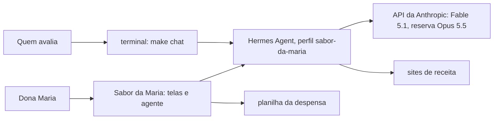
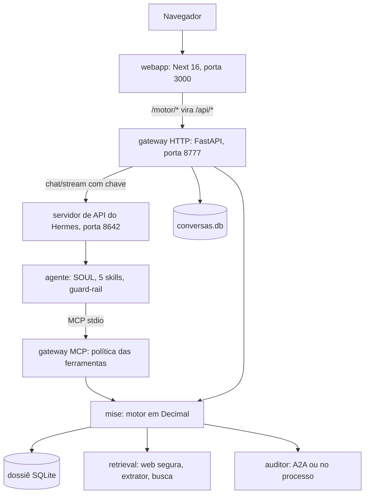
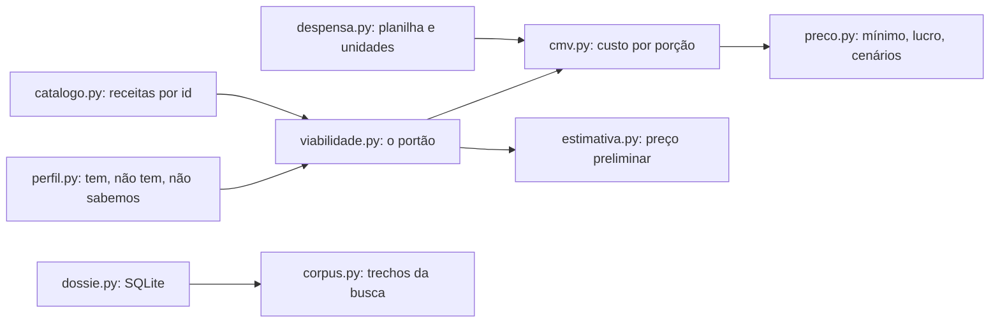
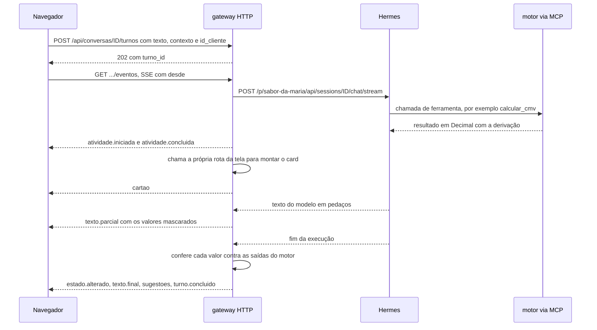
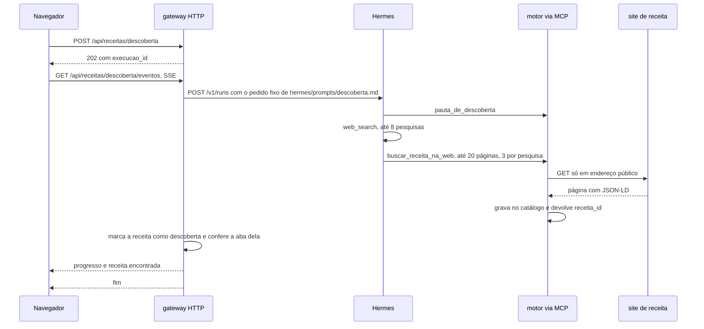
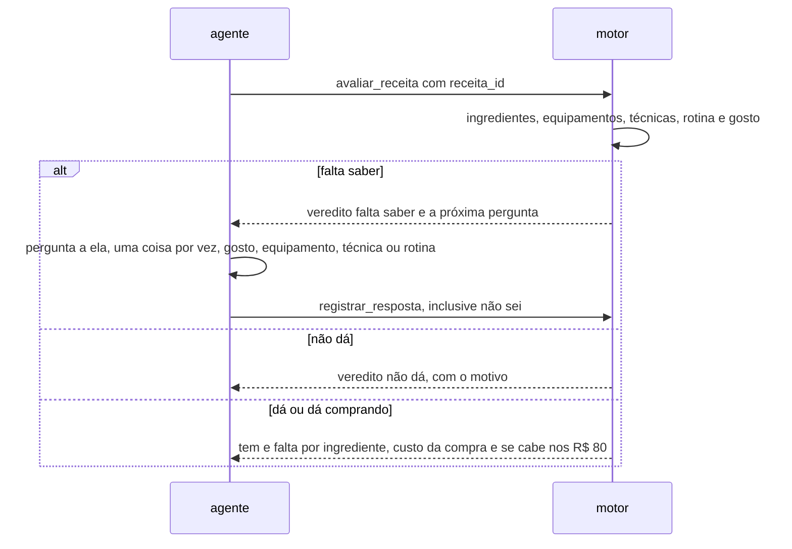
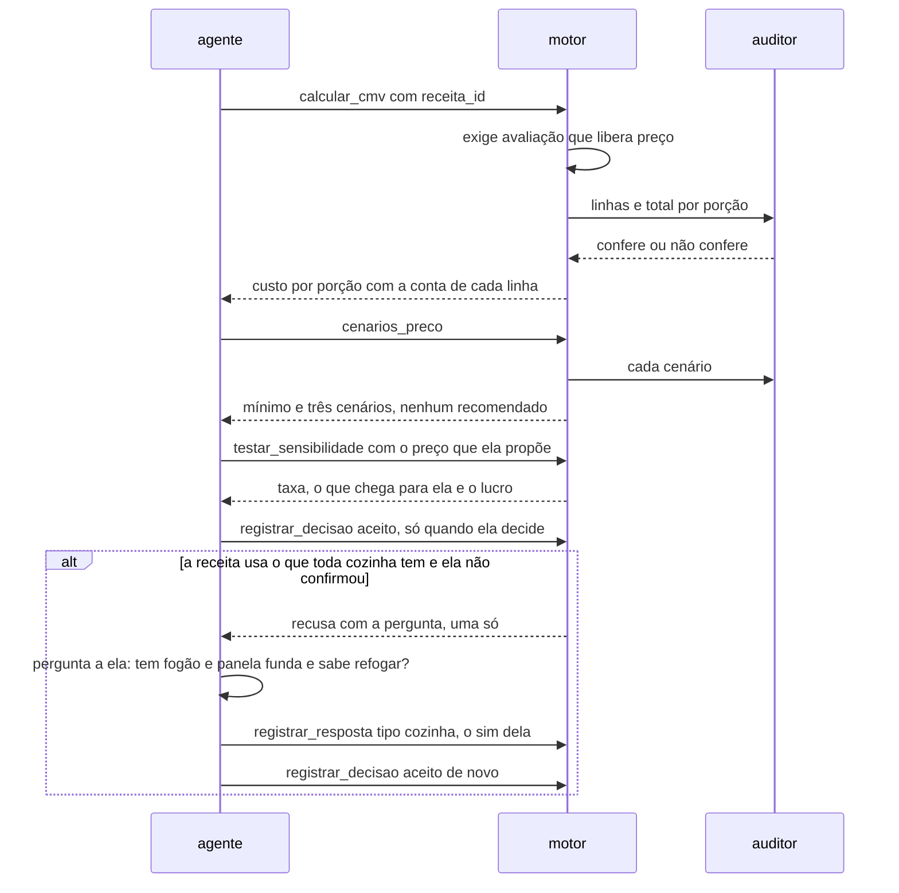

# Arquitetura

Visão em três níveis (contexto, contêineres, componentes) e quatro fluxos em
sequência. As decisões e o porquê de cada uma estão nos [ADRs](adr/README.md).

## Contexto

A Dona Maria usa o site; o agente é o mesmo no site e no terminal. O modelo
é chamado só pelo Hermes. As páginas de receita são lidas pelo servidor, nunca
pelo navegador.

## Contêineres

| Contêiner | Onde | Papel |
|---|---|---|
| `webapp` | `webapp/` | as telas (Início, Despensa, Cozinha, Receitas, Cardápio, Histórico, Pôr preço), o painel da conversa em toda tela e a engrenagem de Preferências |
| gateway HTTP | `gateway/src/gateway/http.py` e `rotas/` | as rotas da tela e da conversa, dono do turno do chat, máscara, cards e ações |
| gateway MCP | `gateway/src/gateway/principal.py` | o servidor `mise` que o Hermes sobe, com autenticação, escopos, limite de taxa, cota, disjuntor e trilha de auditoria |
| Hermes | perfil criado por `hermes/bootstrap.sh` | o laço do agente, as sessões, a compressão, a reserva de modelo e o servidor de API |
| `mise` | `mise/src/mise/` | custo, viabilidade, preço, catálogo, avaliações, dossiê, corpus da busca, preço de referência (média de São Paulo) e peso estimado da embalagem, com a fonte, as 27 ferramentas |
| `retrieval` | `retrieval/src/retrieval/` | busca de página só em endereço público, extração de JSON-LD e microdata, índice híbrido |
| `auditor` | `auditor/src/auditor/` | refaz a conta do preço sem importar o motor |
| `telemetria` | `telemetria/src/telemetria/` | rastro OpenTelemetry, métricas por ferramenta, custo do modelo |

As duas portas do motor chamam as mesmas regras (`Sessao` em
`mise/src/mise/mcp_server.py`): a conversa e a tela nunca calculam por caminhos
diferentes.

## Componentes do motor

## Um turno da conversa na web

## Descoberta de receitas

Com `SABOR_DESCOBERTA` desligada, a rota responde 501 e a tela abre a conversa
com o pedido pronto; a busca acontece no turno, com as mesmas ferramentas.

## A conferência de viabilidade

## O preço

O que toda cozinha tem (fogão, panela funda, faca, refogar, arroz) começa como
suposto e não vira pergunta item por item. O aceite e a compra, pela conversa
e pela tela, pedem que ela confirme o que a receita usa disso, numa pergunta
só (`mise/src/mise/certeza.py`); o checklist de produção de cada receita
(`mise/src/mise/checklist.py`) mostra, grupo por grupo, o que está confirmado,
suposto, pré-determinado com a fonte, ou ainda por saber.

Discordância do auditor segura o preço; auditor fora do ar deixa a conta seguir,
marcada como sem segunda opinião ([ADR 0005](adr/0005-auditor-independente.md)).
