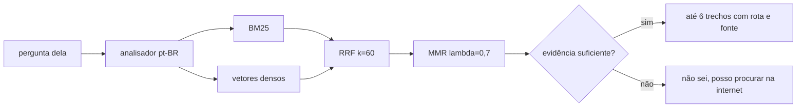

# A busca na plataforma

O agente responde sobre o que existe no site dela e sobre dúvidas de
cozinha com uma ferramenta só, `consultar_conhecimento`. Por trás dela está um
índice híbrido sobre a plataforma inteira, com fonte em cada trecho e um "não
sei" calibrado. A decisão e as alternativas estão no
[ADR 0006](adr/0006-busca-hibrida-na-plataforma.md); aqui fica como funciona,
como medir e como reproduzir.



## O corpus

`mise/src/mise/corpus.py` monta os documentos a partir do dossiê, e
`retrieval/src/retrieval/corpus/` indexa e busca, sem importar o motor. No estado
de referência do conjunto dourado são 197 trechos:

| Tipo | Trechos | O que é | Rota na tela |
|---|---:|---|---|
| `cozinha` | 69 | cada equipamento, técnica e restrição de rotina, com a situação e quem disse | `/cozinha` |
| `conhecimento` | 60 | fatos de cozinha conferidos na fonte | nenhuma |
| `despensa` | 38 | cada um dos 37 itens, com estoque, preço pago, custo com a conta e a linha da planilha, mais o resumo | `/despensa/{id}` e `/despensa` |
| `receita` | 23 | receitas do catálogo em pai e filhos: cabeçalho, ingredientes e um trecho por passo | `/receitas/{slug}` |
| `orcamento` | 3 | orçamento, compras e preços cotados | `/despensa#orcamento` |
| `avaliacao` | 2 | estrelas e notas dela | `/receitas/{slug}` |
| `cardapio` | 2 | pratos aceitos e o resumo | `/cardapio` |

A contagem sai de `evals.recuperacao.montar_estado` e `montar_indice`, o mesmo
estado que a avaliação usa:

```bash
SABOR_VETORIZADOR=ngramas mise/.venv/bin/python -c "
import collections, tempfile, pathlib
from evals import recuperacao as r
with tempfile.TemporaryDirectory() as d:
    indice = r.montar_indice(r.montar_estado(pathlib.Path(d)), r.vetorizador_ngramas())
    print(collections.Counter(t.tipo for t in indice.trechos))"
```

### Trechos pela estrutura

Um trecho por registro, porque cada registro já é curto. A receita é a exceção
estruturada: o pai (`receita:{slug}`), um filho de ingredientes e um filho por
passo, e o achado de um passo volta com o texto do pai (small to big). Todo
trecho começa com um cabeçalho escrito por código, que diz de onde ele é:

- `Alcaparras, na despensa da senhora:`
- `Receita Bolo de fubá, TudoGostoso, passo 2 de 2:`
- `Conhecimento de cozinha, conservação dos alimentos, Geladeira para comida pronta:`

(exemplos dos testes `mise/tests/unit/test_corpus.py` e
`retrieval/tests/test_corpus_conhecimento.py`). Datas vão por extenso, nunca
"hoje", para o trecho continuar verdadeiro amanhã.

O índice se reconstrói quando o carimbo do dossiê muda (um SHA-256 das tabelas),
e os vetores ficam em cache em `.estado/vetores.db`, pela chave
`sha256(modelo + texto)`.

## A busca

- **Analisador** (`retrieval/src/retrieval/corpus/analisador.py`): caixa e
  acento normalizados, 259 palavras vazias, radical leve próprio, unidades por
  extenso (kg vira quilo) e sinônimos aplicados só na pergunta (os de
  `mise.casamento` e 16 grupos de cozinha).
- **BM25** com k1 = 1,5 e b = 0,75, e **vetores densos** com o modelo
  `sentence-transformers/paraphrase-multilingual-MiniLM-L12-v2` pelo FastEmbed.
  Sem o modelo, o lado denso usa trigramas de caractere com hash, em 256
  dimensões.
- **RRF** com k = 60 sobre os 30 melhores de cada lado, e **MMR** com λ = 0,7,
  que conta os passos de uma receita como a receita. Saem até 6 trechos (máximo
  12, pelo parâmetro `k`).
- **Abstenção** (`retrieval/src/retrieval/corpus/busca.py`, `Limiares`): a
  evidência é a maior cobertura da pergunta, ponderada pela raridade de cada
  palavra, entre os três primeiros da fusão e os três primeiros do BM25. Abaixo
  de 0,45 a resposta é "não sei"; cada trecho devolvido precisa cobrir 0,4 da
  pergunta; com o modelo neural, similaridade de cosseno a partir de 0,7 também
  sustenta a resposta.

A variável `SABOR_VETORIZADOR` escolhe o lado denso: `auto` (padrão, usa o modelo
só se ele já estiver baixado), `neural` (baixa se precisar) ou `ngramas`. Os
testes fixam `ngramas`.

### O que a ferramenta devolve

`consultar_conhecimento(pergunta, tipos=None, k=6)` devolve trechos com `id`,
`tipo`, `rota`, `fonte`, `texto` e `pontuacao`, mais `nada_relevante` e um
`texto` para o agente. Sem evidência, `trechos` vem vazio,
`nada_relevante` vem `true` e o texto é a frase fixa:

> Não achei nada sobre isso na plataforma nem na base de cozinha. Não sei, e
> prefiro não chutar. Se a senhora quiser, posso procurar na internet.

O exemplo completo está em
[`contratos/web/conhecimento.json`](../contratos/web/conhecimento.json). Na
conversa, as rotas viram o card "De onde eu tirei isso".

## A base de cozinha

60 fatos em `retrieval/src/retrieval/conhecimento/*.yaml`: técnicas (10),
equipamentos (11), conservação (9), segurança dos alimentos (7), entrega (8),
operação da cozinha (7) e preço (8), de 30 páginas de 20 sites. Cada fato tem
`fonte_url`, `verificado_em` e o `trecho` literal da página. O carregador recusa
fato sem esses campos, com travessão ou com jargão do sistema.

```bash
make conferir-conhecimento     # busca cada página agora e prova que o trecho continua lá (rede)
```

O script (`scripts/conferir_conhecimento.py`) confere 68 citações: os 60 fatos e
as 8 fontes dos parâmetros do preço preliminar. Com `--gravar`, guarda o pedaço
de cada página em volta do trecho em
`scripts/tests/fixtures/conhecimento_paginas.json`; é com ele que o teste
`scripts/tests/test_conferir_conhecimento.py` refaz a prova sem rede, no CI. Um
trecho mudado no YAML deixa de estar na página gravada, e o teste reprova.

## Como medir

O conjunto dourado (`evals/casos/recuperacao.yaml`) tem 57 perguntas: 46 com o
trecho esperado e 11 fora da plataforma, que têm de dar "não sei" (a capital de
um país, futebol, o dólar, a previsão do tempo). Quatro perguntas são
paráfrases sem as palavras do trecho. O estado de referência é fixo (a planilha
real, quatro receitas, um perfil e um momento fixo), então a medida se repete.

```bash
make evals-recuperacao                                      # as duas colunas, na tela
SAIDA=evals/resultados/recuperacao.json make evals-recuperacao   # e grava o JSON
mise/.venv/bin/python -m evals.recuperacao --vetorizador ngramas  # só a coluna do CI
mise/.venv/bin/python -m evals.recuperacao --calibrar       # procura os limiares de novo
```

Métricas: revocação em 5, MRR em 10, nDCG em 10 (ganho binário), acerto de
abstenção sobre as 57 perguntas e latência p50 e p95 com o índice pronto.

### Resultado gravado

De [`evals/resultados/recuperacao.json`](../evals/resultados/recuperacao.json):

| Métrica | Trigramas com hash | Modelo multilíngue |
|---|---:|---:|
| Revocação em 5 | 0,902 | 0,924 |
| MRR em 10 | 0,845 | 0,802 |
| nDCG em 10 | 0,845 | 0,824 |
| Acerto de abstenção | 0,965 | 0,965 |
| Latência p50 | 3,3 ms | 15,9 ms |
| Latência p95 | 14,9 ms | 42,7 ms |

A coluna de trigramas foi reproduzida com o código desta versão
(`--vetorizador ngramas`): as quatro métricas de qualidade batem; a latência
depende da máquina. Os erros que sobram estão anotados como conhecidos no
próprio conjunto:

- "Por quanto tempo a comida pode ficar quentinha esperando o cliente?": os
  trigramas não acham o trecho dos 60 graus; o modelo multilíngue acha.
- "Como sei se o que eu vendo paga as contas do mês?": os dois dizem "não sei",
  que é o erro mais barato.
- "Como está o tempo lá fora hoje?": os dois respondem com trechos de tempo de
  receita; quem lê que eles não falam de clima é o agente.

O piso do CI vale para a coluna de trigramas (revocação 0,88, MRR 0,82, nDCG
0,82, abstenção 0,94) e é conferido por `evals/tests/test_recuperacao.py`.

## O vetorizador neural (opcional)

O CI e a imagem Docker rodam sem ele, para subir sem rede. Para ligar:

```bash
# ambiente criado com uv, que é o padrão do bootstrap
VIRTUAL_ENV=mise/.venv uv pip install -e ./mise -e "./retrieval[semantico]"
# ambiente criado com pip
mise/.venv/bin/python -m pip install -e ./mise -e "./retrieval[semantico]"
```

O extra `semantico` instala o `fastembed`. O modelo baixa uma vez, na primeira
consulta em modo `neural`, para `.estado/modelos`; o `make evals-recuperacao` já
usa esse modo quando o pacote está instalado. Depois disso, `auto` passa a usar
o modelo sozinho. Se ele falhar ao carregar, a busca volta para os trigramas no
mesmo processo, sem erro para ela.

## A calibração

Os limiares saem de uma busca em grade no conjunto dourado
(`evals.recuperacao.calibrar`). O custo de cada combinação é 3 para cada
pergunta fora da plataforma que foi respondida e 1 para cada pergunta legítima
que virou "não sei": responder com confiança o que não se sabe é pior do que
admitir que não sabe. Empate vai para a maior revocação em 5, depois para o
maior MRR, depois para os limiares mais permissivos. Os valores ficam em
`Limiares` (`retrieval/src/retrieval/corpus/busca.py`), com o motivo de cada um
no comentário.
